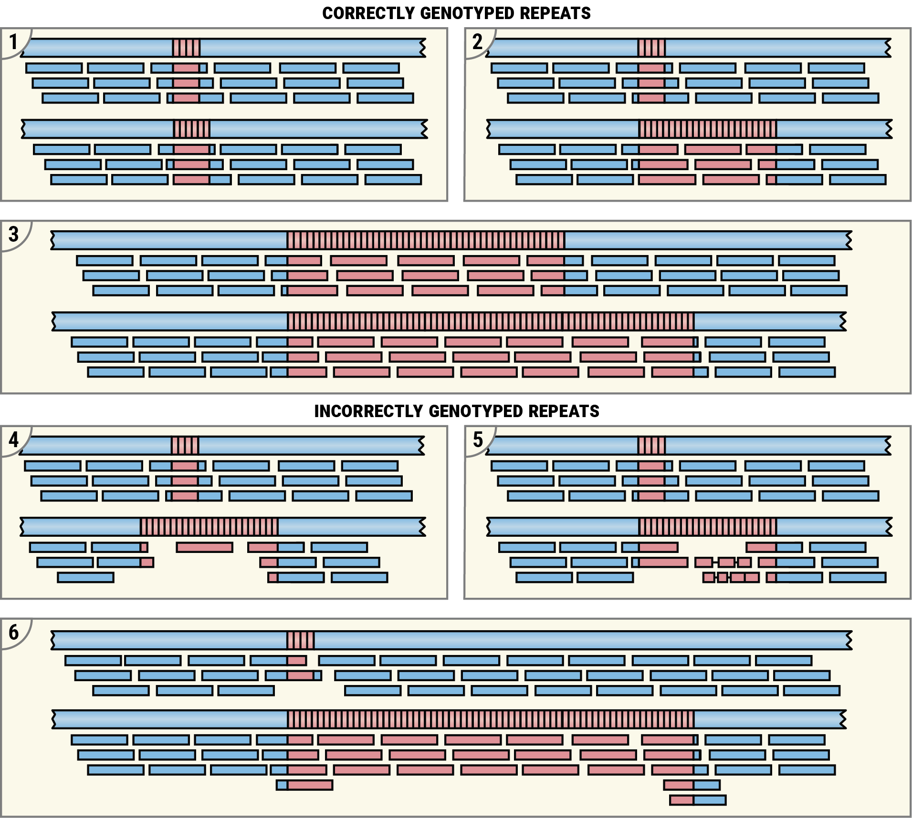

# Examples of read pileups

## Overview

Pileups corresponding to correctly genotyped repeats are characterized by a
relatively even read coverage of both alleles (Figure 1, panels 1-3). At the
typical whole-genome sequencing depths (30-60x), each position of a haplotype
sequence is expected to be covered by many reads (15-30), although the coverage
may dip in certain regions due to technical factors like GC bias. For repeats
much shorter than the read length this implies the presence of multiple spanning
reads (Figure 1, both alleles on panel 1 and short allele on panel 2). The
repeats much larger than the read length are expected to contain multiple
in-repeat reads (Figure 1, long allele on panel 1 and both alleles on panel 2).
Here are real examples corresponding to panels [1](images/example-1-1.pdf),
[2](images/example-1-2.pdf), and [3](images/example-1-3.pdf).

The table below describes the contents of panels 4-6.

| Panel | Issue                     | Explanation                                                                       | Examples                    |
|-------|---------------------------|-----------------------------------------------------------------------------------|-----------------------------|
| 1.4   | False expansion call      | Sequencing depth inside the repeat is very low compared to surrounding reigon     | [4](images/example-1-4.pdf) |
| 1.5   | False expansion call      | Multiple indels in in-repeat reads suggest incorrect alignments                   |                             |
| 1.6   | Missed double expansion   | Short allele supported by very few reads; excess of flanking reads on long allele | [6](images/example-1-6.pdf) |

**Figure 1: Examples of read pileups.** Pileups corresponding to correctly genotyped
repeats: (1) both repeat alleles are short; (2) one allele is expanded; (3) both
alleles are expanded. Pileups corresponding to incorrectly genotyped repeats:
(4) expanded allele is supported by just one read suggesting that its size is
overestimated; (5) expanded allele is supported by poorly aligning reads (each
containing multiple indels) suggesting that the reads are incorrectly mapped and
that size of the repeat is overestimated; (6) the short allele is supported by
just one spanning read suggesting that this allele is not real and that both
alleles are expanded.
