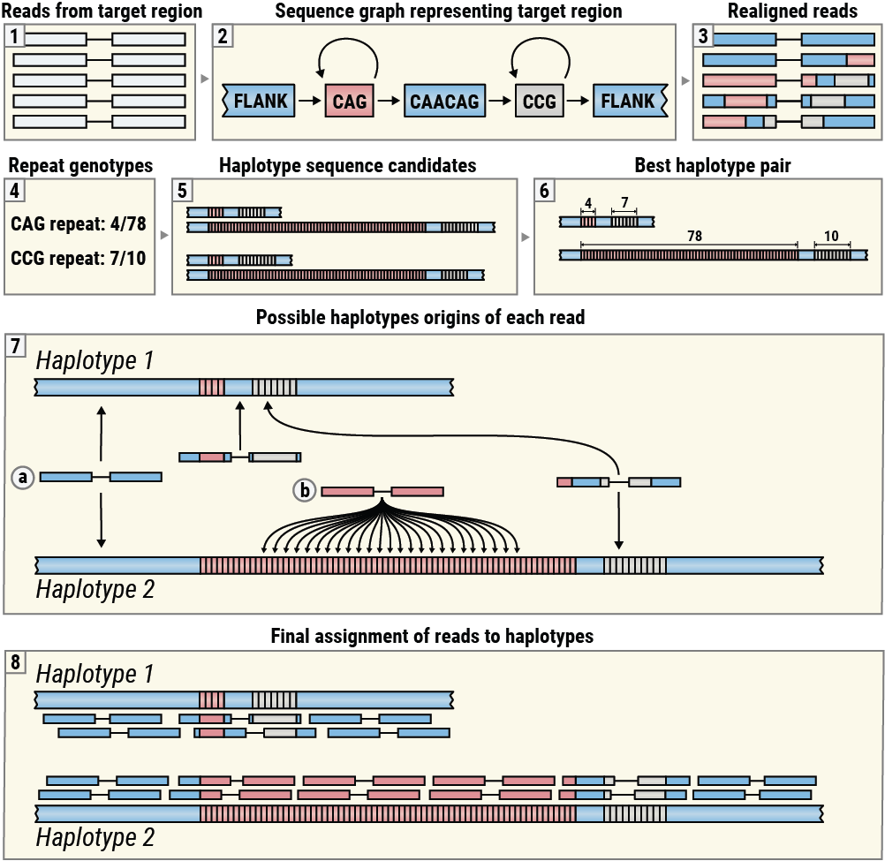

# Overview of the method

REViewer is designed to display alignments of reads generated by ExpansionHunter
(Figure 3, boxes 1-3). These alignments are obtained by realigning reads
originating in the target region to the corresponding sequence graph encoding one
or more repeats located there5. REViewer then constructs putative haplotype
sequences using genotypes produced by ExpansionHunter and then selects a pair of
haplotypes that have the highest consistency with the read alignments (Figure 3,
boxes 4-6). (This step is skipped for repeats on haploid chromosomes.) Next,
REViewer determines the set of possible alignment positions for each read pair
on each haplotype. For example, a read pair originating within a flanking
sequence shared by both haplotypes has exactly one alignment position on each
haplotype (Figure 3, Box 7a) while a read pair whose both mates are comprised
of the repeat sequence has multiple possible origins on haplotypes with
sufficiently long repeats (Figure 3, Box 7b). To generate a read pileup,
REViewer selects one alignment position at random for each read pair. This step
is repeated a specified number of times (10,000 by default) to generate multiple
pileups. The pileup with the most even coverage of each allele is selected for
visualization (Figure 3, Box 8).

This algorithm is based on the idea that if a given locus is sequenced well and
each constituent repeat is genotyped correctly, then it is possible to
distribute the reads to achieve an even coverage of each haplotype. (Although
many reads may not be assigned to the correct haplotype of origin, especially in
cases when the repeats are homozygous, and the resulting haplotypes are
identical.) Conversely, if the size of a repeat is significantly overestimated
or underestimated, no assignment of reads will result in an even pileup making
the genotyping error easy to notice.

## Limitations

* REViewer is a tool for assessing consistency of sequencing data with repeat
genotypes produced by ExpansionHunter. It provides a mechanism for reviewing the
evidence supporting a genotype call in clinical settings and to identify
problematic corner cases to drive future development. 
* The read pileup plots generated by REViewer may contain inaccuracies: 
    * The repeats may not be phased correctly (e.g., when repeats are located 
far apart from each other).
    * Read pairs consistent with both haplotypes will often be assigned to the incorrect
haplotype. 
* REViewer can currently only visualize relatively simple loci with one or two repeat
    tracts and constant sequences. In particular, it cannot interpret locus definitions with
    small variants (e.g., `(A|T)`). **This includes the example case in the ExpansionHunter
    repository**. If you need to test REViewer, use the files under `/reviewer/tests/inputs`
    instead.
* The current version of REViewer visualizes repeats whose span does not exceed 
the fragment length and longer repeats are capped at the fragment length. 

