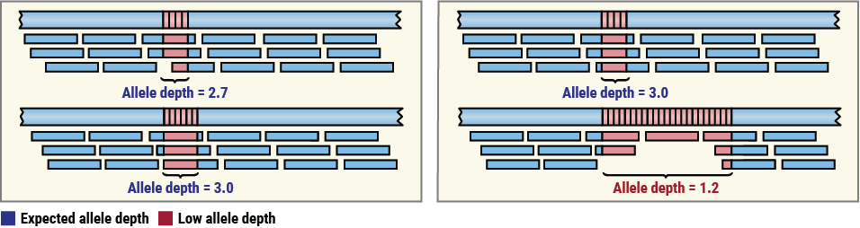

# Quality metrics

REViewer reports various summary measurements, called **quality metrics**, that
describe key properties of read pileups. Quality metrics make it possible to
automate assessment of large collections of STR genotype calls either (a) by
selecting a series of thresholds to stratify the value of each metric into
"good", "suspicious", and "bad" categories, or (b) by using more flexible
statistical / machine learning approaches.

This document describes the quality metrics reported by REViewer. All quality
metrics are stored in a tab-separated (TSV) file `<output prefix>.metrics.tsv`.
If you have suggestions for additional metrics, please consider [creating an
issue](https://github.com/Illumina/REViewer/issues).

## Allele depth

In general, sequencing depth of a whole-genome sequencing sample is the average
number of reads that overlap any given genomic position in that sample. (For
example, a depth of 30x means that a base would be overlapped by 30 reads on
average.) The **allele depth** metric is an extension of this concept to STRs:
It reports the sequencing depth of each STR allele. The diagram below shows an
example of a well-genotyped repeat (left) where both STR alleles have the
expected sequencing depth and an example (right) where the size of the long
allele may be overestimated.

